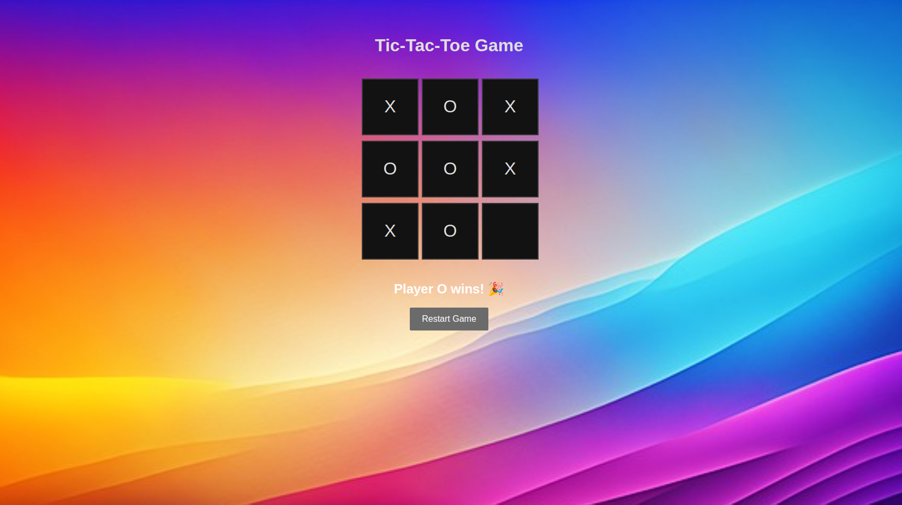

# PRODIGY_WD_02
Web-based Tic Tac Toe game | Internship Project | HTML • CSS • JavaScript

# 🎮 Tic Tac Toe Web App – Task 02

This is a simple and interactive **Tic Tac Toe** game built using **HTML, CSS, and JavaScript**.  
It was developed as part of my **Web Development Internship at Prodigy Infotech**.

## 📌 Features

- Two-player game
- Real-time game logic
- Win, lose, and draw detection
- Reset functionality for new game rounds
- Simple, responsive user interface

## 🛠 Tech Stack

- **HTML** – for structuring the web page  
- **CSS** – for styling and layout  
- **JavaScript** – for game logic and interactivity

## 📸 Screenshot



## 🚀 How to Use

1. Clone the repository:
   ```bash
   git clone https://github.com/Shristi-Roy/PRODIGY_WD_02.git
